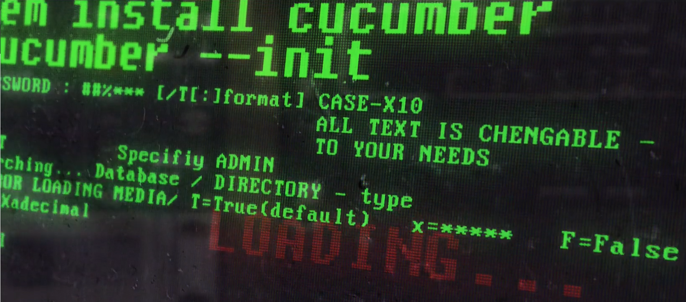

## Vamos criar um Projeto do ZERO

Você foi contratado para trabalhar no Projeto Enjoeat, um projeto de Desenvolvimento ágil. E vamos trabalhar juntos para desenvolver uma WebApp.


Vamos começar criando um novo diretório e um projeto Ruby vazio.
```bash
mkdir enjoeat
cd enjoeat
```

Crie um **Gemfile** com o seguinte conteúdo:
```bash
source "https://rubygems.org"

group :test do
  gem 'capybara', '3.14'
  gem 'cucumber', '3.1.2'
  gem 'rspec', '3.7.0'
  gem 'selenium-webdriver', '3.141'
end
```

Instale todas as dependências e crie um projeto **Cucumber**:
```bash
bundle install
cucumber --init
```
<h1 align="center"></img></h1>


Dentro da pasta **features**, crie um arquivo chamado **restaurantes.feature** e dentro dele, escreva a seguinte **especificação**:
```bash
#language: pt

Funcionalidade: Restaurantes    
    Para que eu possa saber quais os restaurantes disponíveis com o tempo de entrega e nota de avaliação
    Sendo um usuário que deseja pedir comida
    Posso acessar a lista de restaurantes

    Cenario: Todos os restaurantes

        Quando acesso a lista de restaurantes
        Então vejo todas as opções disponíveis

    Cenario: Categorias

        Quando acesso a lista de restaurantes
        Então cada restaurante deve exibir sua categoria

    Cenario: Tempo de entrega

        Quando acesso a lista de restaurantes
        Então cada restaurante deve exibir o tempo de entrega

    Cenario: Nota de avaliação

        Quando acesso a lista de restaurantes
        Então cada restaurante deve exibir sua nota de avaliação
```

Como ficou?

A linha três deste arquivo começa com a palavra-chave **Funcionalidade**: 

seguida pelo nome "**Restaurantes**". É uma boa prática usar um nome semelhante ao nome do arquivo.

A segunda linha é uma breve descrição do recurso, em nosso caso a estória do usuário. 

O Cucumber não executa essa linha, pois é apenas a documentação.

Na sequencia temos os  cenários, que são exemplos concretos que ilustram como a aplicação deverá se comportar.

Por fim temos os steps **Quando** e **Então** que são os passos do nosso cenário. Isto é o que Cucumber irá executar.
```bash
Quando fazemos o Desenvolvimento Orientado por Comportamento com o Cucumber, usamos exemplos concretos para 

especificar o que queremos que o software faça. Os cenários são gravados antes do código de produção. 

Eles começam sua vida como uma especificação executável . À medida que o código de produção surge, os cenários 

assumem um papel como documentação viva e testes automatizados .
```
Pronto, agora podemos começar a trabalhar com especificação e automação para projetos ágeis.


----------
Feito com ♥ by Tayna Rodrigues - Manaus-AM  👋 


