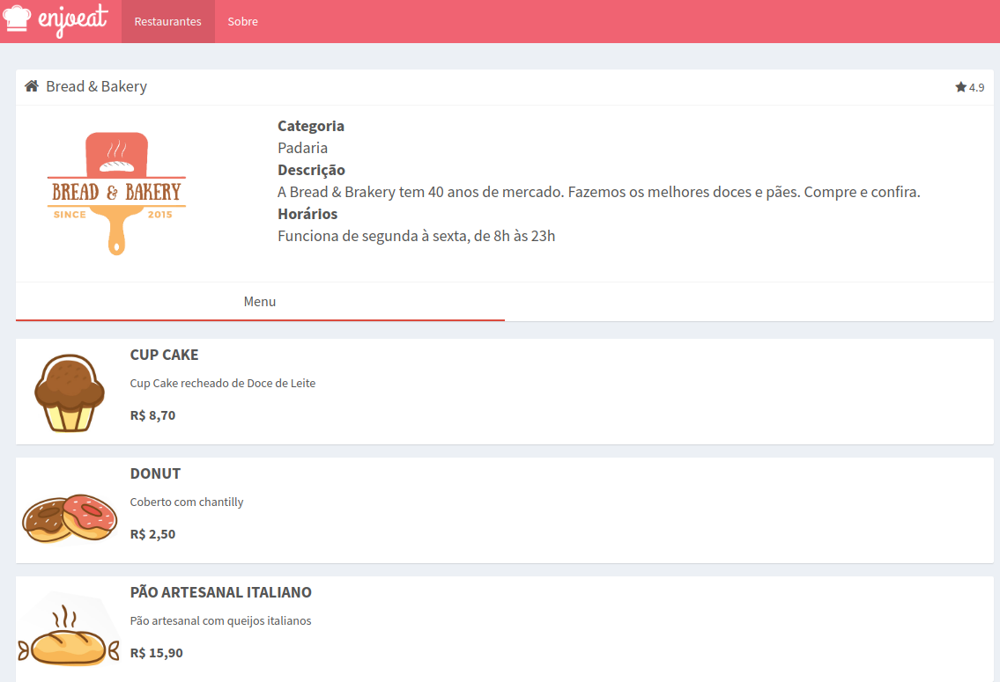
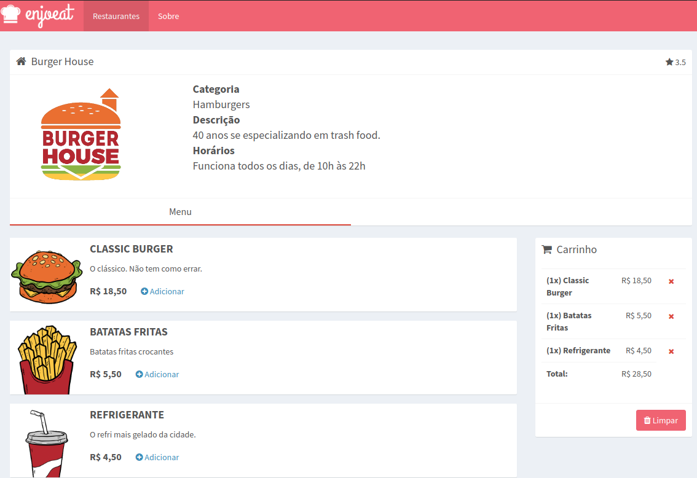
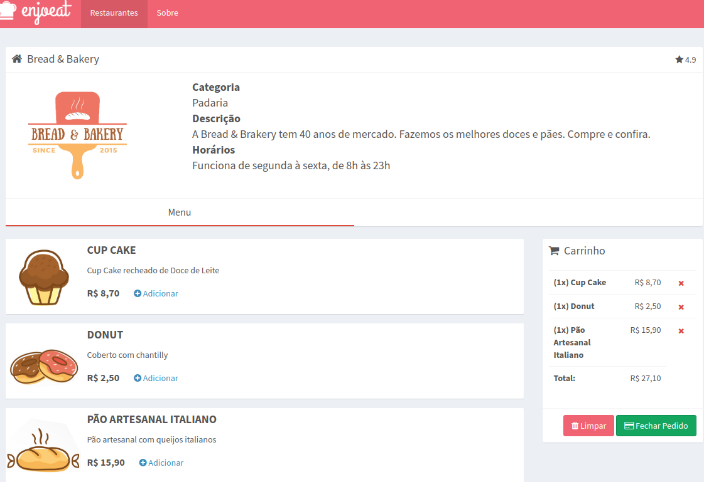
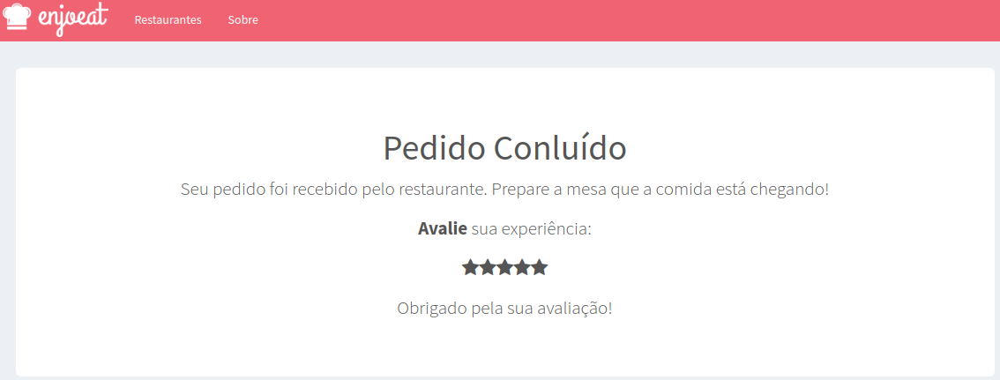

## Projeto ENJOEAT EM ANGULAR JS

O enjoeat é uma aplicação feita em Angular JS e roda dentro de um ambiente NodeJS. É um aplicativo para treinar automação com uma mehor performance do curso QANinja.

## Ambiente local com NodeJS
Vamos configurar o sistema Enjoeat de modo local em nossos computadores. Dessa forma você terá um melhor controle e performance do seu ambiente de testes.

Primeiramente vamos instalar o Nodejs
Nos tutoriais abaixo temos instalação do Ruby e Nodejs (Você poderá pular a instalação do Ruby e seguir somente com Nodejs, ou atualizar sua versão do Ruby)


- 💹 **No Windows** — (http://blog.qaninja.io/instalando-ruby-e-nodejs-no-windows/)

- 💹 **No Linux** — (http://blog.qaninja.io/instalando-ruby-e-nodejs-no-linux/)

- 💹 **No Mac** — (http://blog.qaninja.io/instalando-o-ruby-e-nodejs-no-macos/)


Para verificar se deu tudo certo, digite o comando:
```bash
# NÃO é preciso executar a linha de baixo caso ja tenha o NodeJS instalado
node -v
npm -v
```

### Configurando o Enjoeat no seu computador local
Para iniciar descompacte no seu diretório o arquivo **enjoeat-sp1.zip** dentro da pasta **projetoEnjoeat**
Para rodar o **Enjoeat** utilize os comandos para ele instalar todas as dependências do enjoeat que no caso é o: express, json-server, nodemon
```bash
cd qaninja
cd projetoEnjoeat
cd enjoeat-sp1
cd enjoeat-sp1
npm install
npm start
```
Assim que o processo terminar, abra o seu navegador a página http://localhost:3000 contendo o Projeto **Enjoeat Sprint 1** disponível em `localhost:3000`

<h1 align="center"></img></h1>


### Configurando o Enjoeat no seu computador local - segunda parte do curso
Para iniciar descompacte no seu diretório o arquivo **enjoeat-sp2.zip** dentro da pasta **projetoEnjoeat**
Para rodar o **Enjoeat** utilize os comandos para ele instalar todas as dependências do enjoeat que no caso é o: express, json-server, nodemon
```bash
cd qaninja
cd projetoEnjoeat
cd enjoeat-sp2
cd enjoeat-sp2
npm install
npm start
```
Assim que o processo terminar, abra o seu navegador a página http://localhost:3000 contendo o Projeto **Enjoeat Sprint 2** disponível em `localhost:3000`

<h1 align="center"></img></h1>


### Configurando o Enjoeat no seu computador local - terceira parte do curso
Para iniciar descompacte no seu diretório o arquivo **enjoeat-sp3.zip** dentro da pasta **projetoEnjoeat**
Para rodar o **Enjoeat** utilize os comandos para ele instalar todas as dependências do enjoeat que no caso é o: express, json-server, nodemon
```bash
cd qaninja
cd projetoEnjoeat
cd enjoeat-sp3
cd enjoeat-sp3
npm install
npm start
```
Assim que o processo terminar, abra o seu navegador a página http://localhost:3000 contendo o Projeto **Enjoeat Sprint 3** disponível em `localhost:3000`

<h1 align="center"></img></h1>


### Configurando o Enjoeat no seu computador local - quarta e última parte do curso
Para iniciar descompacte no seu diretório o arquivo **enjoeat-sp4.zip** dentro da pasta **projetoEnjoeat**
Para rodar o **Enjoeat** utilize os comandos para ele instalar todas as dependências do enjoeat que no caso é o: express, json-server, nodemon
```bash
cd qaninja
cd projetoEnjoeat
cd enjoeat-sp4
cd enjoeat-sp4
npm install
npm start
```
Assim que o processo terminar, abra o seu navegador a página http://localhost:3000 contendo o Projeto **Enjoeat Sprint 4** disponível em `localhost:3000`

<h1 align="center"></img></h1>

<h1 align="center"></img></h1>


----------
Feito com ♥ by Tayna Rodrigues - Manaus-AM  👋 


